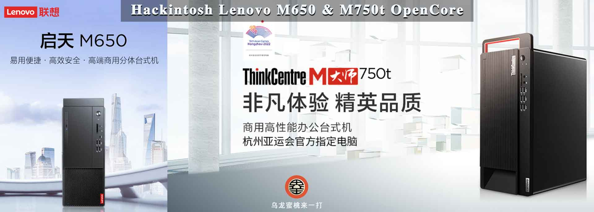
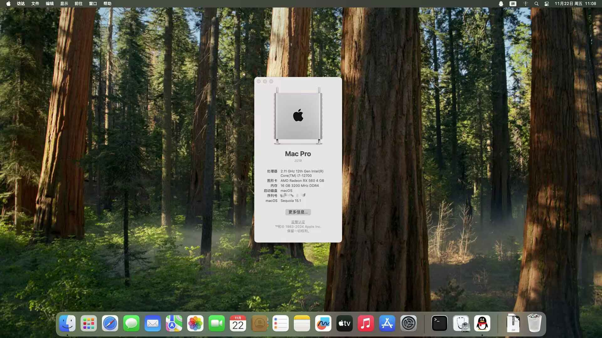

## Lenovo-M650-ThinkCentre-M750t Intel Gen12-13 Hackintosh OpenCore EFI

### [简体中文](README.zh_CN.md)

### OpenCore

[OpenCore 1.0.2](https://github.com/acidanthera/OpenCorePkg)

### OS Version Tested

- macOS Ventura  13.x
- macOS Sonoma 14.x
- macOS Sequoia 15.x

### Hardware

- Motherboard: Intel Q670
- Bios Version: M4UKT43A [07/05/2024] 
- CPU: Intel i7-12700
- RAM: King Tiger 16G DDR4 3200
- SSD: WD Blue SN580 2TB MacOS
- HDD: WDC WD10EZEX Windows
- iGPU: Intel® UHD Graphics 770 [ macOS is Not Supported ]
- GPU：AMD Radeon RX560 4GB [ No-Power Supply ,Full load power 75W ]
- Audio: Realtek ALC623
- Ethernet Card: Intel® Ethernet Connection I219-LM

### Bios Settings

Power -- Automatic Power On -- Wake on LAN  : Disabled

Security -- Secure Boot ：Disabled

### Notes

 - Use [OCAuxiliaryTools](https://github.com/ic005k/OCAuxiliaryTools) build your SMBIOS

### Known issues

- No Wireless LAN Adapter，So `WiFi` and `Bluetooth` unserviceable .

### ScreenShot 

- About This Mac

  

### Contact Us

 - QQ Group: 23304408

